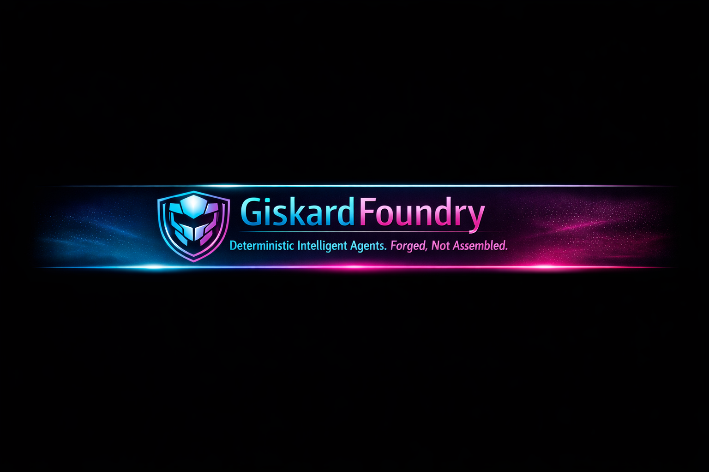

<p align="center">
  
</p>
# GiskardFoundry

GiskardFoundry is a lightweight, deterministic agent framework designed for auditable automation and integration into application-specific systems such as LeadForgeAI.

It provides reusable primitives for configuration loading, prompt resolution, and agent execution while keeping domain logic in consuming applications.

## Overview

Core capabilities:

- Configuration bridge via `GFConfig`
- Prompt and behavior lookup via `PromptRegistry`
- Minimal agent execution abstraction via `Agent`
- Orchestration hooks for multi-agent runtime patterns

Design goals:

- deterministic behavior under identical inputs
- explicit module boundaries and stable integration surface
- side-effect-free imports for predictable runtime startup
- portfolio-safe structure with no private scoring or proprietary evaluation rules

## Public API

Use only these imports for integration code:

```python
from giskardfoundry.config import GFConfig
from giskardfoundry.registry import PromptRegistry
from giskardfoundry.agents import Agent
```

Additional orchestrator entrypoints:

```python
from giskardfoundry.susan_calvin import SusanCalvin, run_susan_calvin_server
```

`__init__.py` export surface:

- `GFConfig`
- `PromptRegistry`
- `Agent`
- `SusanCalvin`
- `run_susan_calvin_server`

## Example Usage

```python
from giskardfoundry.config import GFConfig
from giskardfoundry.registry import PromptRegistry
from giskardfoundry.agents import Agent

cfg = GFConfig.from_env()
registry = PromptRegistry.from_config(cfg)
prompt = registry.get("example.hello", default="Hello")

agent = Agent(prompt=prompt, context={"system": "demo"}, name="example_agent")
result = agent.run({"name": "Drew"})

print(result)
```

Expected result characteristics:

- returns structured dictionary payloads
- no network calls from base primitives
- deterministic output shape for repeatability

## Architecture

Current architecture (text-only):

- Consumer applications (for example, LeadForgeAI) call the public API surface.
- `GFConfig` resolves runtime configuration values.
- `PromptRegistry` loads and resolves prompts from configuration.
- `Agent` executes deterministic, structured workflows using resolved prompts.
- `SusanCalvin` orchestrates multi-agent routing when orchestration is enabled.

## Installation

### Requirements

- Python 3.11+
- virtual environment recommended

### Local setup

```bash
python -m venv .venv
.venv\Scripts\activate
pip install -e .
```

### Optional environment variables

- `GF_ENV` (default: `development`)
- `GF_PROMPTS_PATH` (default: `config/prompts.json`)
- `FOUNDRY_PROJECT_ENDPOINT` (required for Foundry hosting workflows)
- `FOUNDRY_MODEL_DEPLOYMENT_NAME` (required for Foundry hosting workflows)

### Run checks

```bash
python scripts/validate_manifests.py
python -m pytest -q
```

## Determinism and Auditability

GiskardFoundry emphasizes reproducible behavior and operational transparency.

Determinism controls:

- pure, side-effect-free module imports
- explicit configuration defaults in `GFConfig.from_env()`
- predictable prompt lookup behavior in `PromptRegistry.get()`
- stable output schema in base `Agent.run()`

Auditability controls:

- explicit config source and environment binding
- manifest-driven agent metadata
- structured output payloads suitable for logging and trace pipelines

## Notes

- LeadForgeAI is an external consumer and should import GiskardFoundry through a single adapter boundary.
- Modules outside the documented public API may change without notice.
