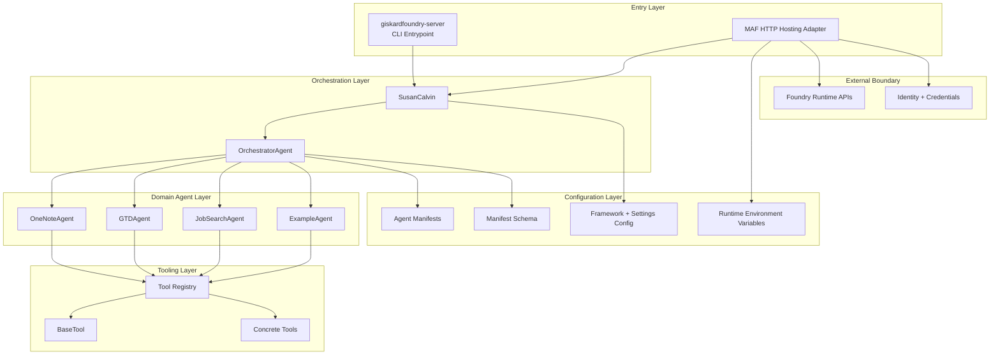

# GiskardFoundry Architecture

## Notes

- Scope emphasizes portfolio-safe architecture and public framework boundaries.
- Competitive logic and private evaluation rules are intentionally excluded from this view.
